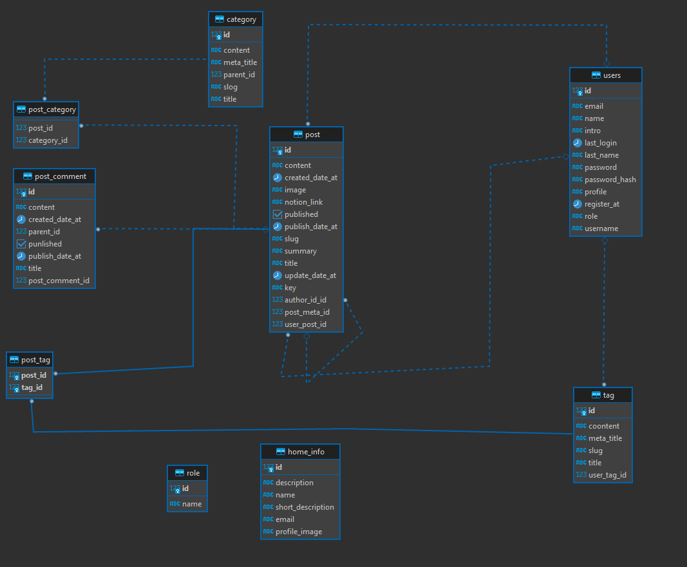

# Spring Boot JWT Web API

> ### Spring boot + Hibernate + JWT  codebase containing real world examples (CRUD, auth, advanced patterns, etc) that adheres to the spec and API.

# *Db* Schema 

[](https://site.ishakdas.dev/)

The basic logic of this Rest API is mostly based on posts and users.
What can be added to a post?
- Tag
- Comment
- Category

Users registered to the application will be able to share posts.

# How is JWT Token used ?

Users will be able to receive tokens while signing up and logging in.
In addition, after the token expires, it will check during the usage phase and generate new tokens.

# Hibernate

PostgreSql was used in the web service.
The tables and relationships to use were created with Hibernate.
Extremely good conditioning was used with the Hibernate Criteria feature.

# Unit Test

    /register
    /authenticate
    /hello
    
All Routes

Permission

    /helloadmin

Used without tokens

    /authenticate
    /register
    /getResponse
    /refreshtoken
    /home
    /blog
    /blog/{slugName}
    
    
    
    
# You can run and open terminal
    curl http://localhost:8080/blog
    
    

----

	@RequestMapping(value = "/home", method = RequestMethod.GET)
	public ResponseEntity<?> homeInfo1() throws Exception {
		try {
			HomeInfo homeInfo = homeInfoService.homeInfoAll();
			return ResponseEntity.ok(homeInfo);

		} catch (Exception e) {
			return ResponseEntity.status(HttpStatus.NOT_FOUND).body(e);
		}

	}
}
----

# For Example

/blog
```javascript
[
    {
        "title": "Redis Güvenlik Sıkılaştırmaları",
        "date": "2022-10-20 00:26:40.931",
        "author": "İshak Akdaş",
        "slug": "Redis-Guvenlik-Sikilastirmalari",
        "notion_link": "https://elated-tarsal-3d8.notion.site/Redis-G-venlik-S-k-la-t-rmalar-302af50ba8114acf97e5197ab9933694",
        "image": "https://miro.medium.com/max/828/0*JCEb87dJnTyMjDUw"
    }
]
```

/home
```javascript
{
    "id": 1,
    "name": "İshak Akdaş",
    "shortDescription": "I'm a Full Stack developer",
    "description": "I'm a Full Stack developer with experience in DevOps, Backend, Frontend and mobile development.",
    "profile": "/me.png",
    "email": "mailto:furkan.ishack@gmail.com"
}
```

# Production

You can access the frontend that I use this web service from  [here](https://site.ishakdas.dev/).
